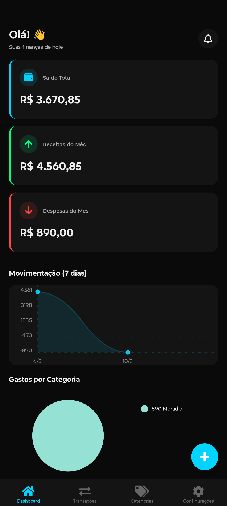
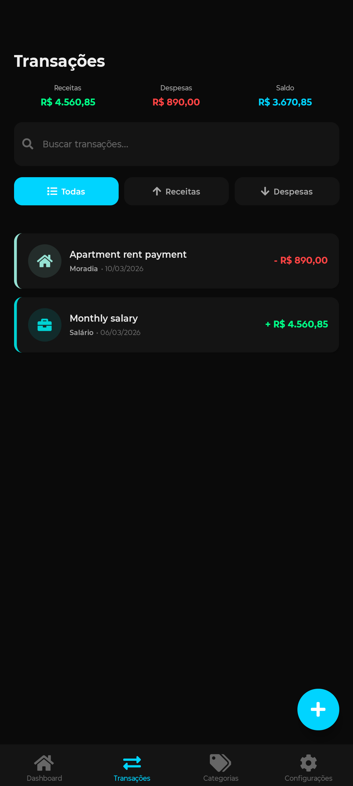
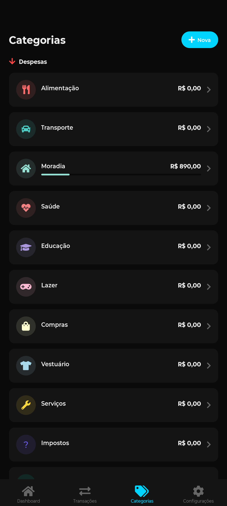
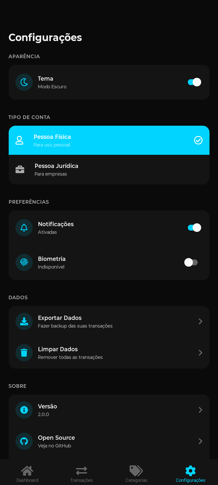

# 💰 Finance Manager Pro

<div align="center">


**Gerenciador Financeiro Profissional para Pessoa Física e Jurídica**

Um aplicativo mobile completo para gestão financeira pessoal e empresarial, com suporte a categorias personalizadas, integração Open Finance e análises detalhadas.

[Features](#-features) • [Instalação](#-instalação) • [Uso](#-uso) • [Arquitetura](#-arquitetura) • [API](#-api-open-finance) • [Contribuindo](#-contribuindo)

</div>

---

## 📱 Screenshots

<div align="center">
    
    
    
    
</div>

## ✨ Features

### 🎯 Funcionalidades Principais

- ✅ **Gestão de Transações**
  - Registro de receitas e despesas
  - Categorização automática e manual
  - Edição e exclusão de transações
  - Busca e filtros avançados
  - Anexos e notas

- 📊 **Dashboard Completo**
  - Visão geral do saldo
  - Gráficos de receitas vs despesas
  - Análise por categoria
  - Tendências mensais
  - Projeções e metas

- 🏷️ **Categorias Personalizáveis**
  - 12 categorias de despesas pré-definidas
  - 7 categorias de receitas pré-definidas
  - Criação de categorias customizadas
  - Ícones e cores personalizados
  - Subcategorias (em breve)

- 🏦 **Integração Open Finance** (Estrutura Pronta)
  - Conexão com bancos via Open Banking
  - Sincronização automática de transações
  - Múltiplas contas bancárias
  - Saldo em tempo real
  - Categorização inteligente com IA

- 💼 **Suporte PF e PJ**
  - Modo Pessoa Física
  - Modo Pessoa Jurídica
  - Relatórios específicos por tipo
  - Categorias adaptadas

- 📈 **Análises e Relatórios**
  - Gastos por categoria
  - Comparativo mensal
  - Orçamentos e metas
  - Exportação de dados
  - Gráficos interativos

### 🔧 Recursos Técnicos

- 📱 React Native + Expo
- 💾 Armazenamento local com AsyncStorage
- 🎨 UI moderna e responsiva
- 🌙 Tema dark otimizado
- ⚡ Performance otimizada
- 🔒 Dados criptografados
- 📴 Funciona offline
- 🔄 Sincronização em nuvem (planejado)

## 🚀 Instalação

### Pré-requisitos

- Node.js 18+ 
- npm ou yarn
- Expo CLI
- Dispositivo Android/iOS ou Emulador

### Passo a Passo

```bash
# 1. Clone o repositório
git clone https://github.com/lumaXs/FinanceManager.git
cd FinanceManager

# 2. Instale as dependências
npm install
# ou
yarn install

# 3. Inicie o projeto
npx expo start

# 4. Execute no dispositivo
# Escaneie o QR Code com Expo Go (Android/iOS)
# ou pressione 'a' para Android / 'i' para iOS
```

### Build para Produção

```bash
# Android
npx expo build:android

# iOS (requer macOS)
npx expo build:ios

# Web
npx expo build:web
```

## 📖 Uso

### Criando uma Transação

```javascript
// Exemplo de criação programática
import { Transaction } from './src/models';
import { TRANSACTION_TYPES } from './src/constants';

const novaTransacao = new Transaction({
  description: 'Compra no Supermercado',
  amount: 150.50,
  type: TRANSACTION_TYPES.EXPENSE,
  category: 'alimentacao',
  date: new Date().toISOString(),
  notes: 'Compras mensais',
  isPaid: true,
});
```

### Usando Hooks

```javascript
import { useTransactions } from './src/hooks/useTransactions';

function MeuComponente() {
  const {
    transactions,
    loading,
    addTransaction,
    getTotals,
  } = useTransactions();

  const totals = getTotals();

  return (
    <View>
      <Text>Saldo: {totals.balance}</Text>
      <Text>Receitas: {totals.income}</Text>
      <Text>Despesas: {totals.expenses}</Text>
    </View>
  );
}
```

## 🏗️ Arquitetura

### Estrutura de Pastas

```
finance-manager-pro/
├── src/
│   ├── components/          # Componentes reutilizáveis
│   │   ├── DashboardCard.js
│   │   ├── TransactionItem.js
│   │   ├── TransactionModal.js
│   │   └── ...
│   ├── screens/             # Telas da aplicação
│   │   ├── HomeScreen.js
│   │   ├── TransactionsScreen.js
│   │   ├── CategoriesScreen.js
│   │   └── SettingsScreen.js
│   ├── services/            # Serviços e API
│   │   ├── storageService.js
│   │   └── openFinanceService.js
│   ├── hooks/               # Hooks personalizados
│   │   └── useTransactions.js
│   ├── models/              # Modelos de dados
│   │   └── index.js
│   ├── constants/           # Constantes e configurações
│   │   └── index.js
│   ├── utils/               # Funções utilitárias
│   │   └── helpers.js
│   └── assets/              # Imagens e ícones
├── App.js                   # Componente raiz
├── app.json                 # Configuração Expo
├── package.json             # Dependências
└── README.md               # Documentação
```

### Padrões de Código

#### Models (Modelos de Dados)

```javascript
// Transaction Model
class Transaction {
  constructor({ description, amount, type, category, date }) {
    this.id = generateId();
    this.description = description;
    this.amount = amount;
    this.type = type; // 'income' | 'expense'
    this.category = category;
    this.date = date;
  }

  isValid() {
    return this.description && this.amount > 0 && this.category;
  }
}
```

#### Services (Camada de Dados)

```javascript
// Storage Service
class StorageService {
  async getTransactions() { /* ... */ }
  async saveTransaction(transaction) { /* ... */ }
  async updateTransaction(id, updates) { /* ... */ }
  async deleteTransaction(id) { /* ... */ }
}
```

#### Hooks (Lógica Reutilizável)

```javascript
// useTransactions Hook
export const useTransactions = () => {
  const [transactions, setTransactions] = useState([]);
  const [loading, setLoading] = useState(true);

  useEffect(() => {
    loadTransactions();
  }, []);

  return {
    transactions,
    loading,
    addTransaction,
    updateTransaction,
    deleteTransaction,
  };
};
```

## 🔌 API Open Finance

### Configuração

A integração com Open Finance está preparada mas requer configuração adicional:

```javascript
// 1. Registre-se em um provedor Open Finance
// Exemplos: Belvo, Pluggy, Plaid, etc.

// 2. Configure as credenciais
// src/constants/index.js
export const API_CONFIG = {
  OPEN_FINANCE_BASE_URL: 'https://api.seu-provedor.com',
  CLIENT_ID: 'seu_client_id',
  CLIENT_SECRET: 'seu_client_secret',
};

// 3. Use o serviço
import openFinanceService from './src/services/openFinanceService';

// Conectar banco
const { authUrl } = await openFinanceService.initiateConnection('nubank');

// Sincronizar transações
const transactions = await openFinanceService.syncTransactions(accountId);
```

### Provedores Suportados

- 🟣 Nubank
- 🔵 Banco Inter
- 🟠 Itaú
- 🔴 Bradesco
- 🟢 Banco do Brasil
- E mais de 300 instituições...

## 📊 Categorias Pré-Definidas

### Despesas (12)

| Categoria | Ícone | Cor |
|-----------|-------|-----|
| Alimentação | 🍽️ | `#FF6B6B` |
| Transporte | 🚗 | `#4ECDC4` |
| Moradia | 🏠 | `#95E1D3` |
| Saúde | ❤️ | `#F38181` |
| Educação | 🎓 | `#AA96DA` |
| Lazer | 🎮 | `#FCBAD3` |
| Compras | 🛍️ | `#FFFFD2` |
| Vestuário | 👕 | `#A8D8EA` |
| Serviços | 🔧 | `#FFD93D` |
| Impostos | 📄 | `#6C5CE7` |
| Investimentos | 📈 | `#00B894` |
| Outros | ⋯ | `#636E72` |

### Receitas (7)

| Categoria | Ícone | Cor |
|-----------|-------|-----|
| Salário | 💼 | `#00D2D3` |
| Freelance | 💻 | `#55EFC4` |
| Rendimentos | 📈 | `#74B9FF` |
| Vendas | 🛒 | `#A29BFE` |
| Aluguel | 🔑 | `#FD79A8` |
| Bônus | 🎁 | `#FDCB6E` |
| Outros | ➕ | `#636E72` |

## 🎨 Personalização

### Tema de Cores

```javascript
// src/constants/index.js
export const COLORS = {
  primary: '#00D4FF',      // Azul principal
  secondary: '#7C3AED',    // Roxo secundário
  success: '#00FF88',      // Verde sucesso
  danger: '#FF4444',       // Vermelho perigo
  background: '#0A0A0A',   // Fundo escuro
  // ... mais cores
};
```

### Criando Categorias Customizadas

```javascript
const novaCategoria = new Category({
  name: 'Pets',
  icon: 'paw',
  color: '#FF6B9D',
  type: 'expense',
  isCustom: true,
});

await storageService.saveCategory(novaCategoria);
```

## 🔒 Segurança e Privacidade

- ✅ Dados armazenados localmente
- ✅ Nenhuma informação enviada para servidores externos (exceto Open Finance autorizado)
- ✅ Criptografia de dados sensíveis
- ✅ Autenticação biométrica (planejado)
- ✅ Backup criptografado (planejado)

## 🧪 Testes

```bash
# Executar testes
npm test

# Testes com coverage
npm run test:coverage

# Testes em modo watch
npm run test:watch
```

## 📦 Build e Deploy

### Android (APK)

```bash
# Build development
npx expo build:android -t apk

# Build production (AAB)
npx expo build:android -t app-bundle
```

### iOS (IPA)

```bash
# Build para TestFlight
npx expo build:ios

# Build ad-hoc
npx expo build:ios -t archive
```

## 🛣️ Roadmap

### v2.1.0 (Q2 2026)
- [ ] Implementação completa Open Finance
- [ ] Sincronização em nuvem
- [ ] Modo multi-usuário
- [ ] Exportação para PDF/Excel

### v2.2.0 (Q3 2026)
- [ ] Widgets para tela inicial
- [ ] Notificações push
- [ ] Metas e orçamentos avançados
- [ ] Análise com IA

### v3.0.0 (Q4 2026)
- [ ] Versão Web completa
- [ ] API pública
- [ ] Marketplace de temas
- [ ] Integrações com e-commerce

## 🤝 Contribuindo

Contribuições são bem-vindas! Por favor, siga estas etapas:

1. Fork o projeto
2. Crie uma branch para sua feature (`git checkout -b feature/AmazingFeature`)
3. Commit suas mudanças (`git commit -m 'Add some AmazingFeature'`)
4. Push para a branch (`git push origin feature/AmazingFeature`)
5. Abra um Pull Request

### Guidelines

- Siga os padrões de código existentes
- Escreva testes para novas funcionalidades
- Atualize a documentação
- Use commits semânticos

## 📄 Licença

Este projeto está licenciado sob a Licença MIT - veja o arquivo [LICENSE](LICENSE) para detalhes.

## 👥 Autores

- **Equipe Finance Manager Pro** - *Desenvolvimento inicial*

## 🙏 Agradecimentos

- React Native Community
- Expo Team
- Todos os contribuidores

## 📞 Suporte

- 📧 Email: suporte@financemanagerpro.com
- 💬 Discord: [Entre no servidor](https://discord.gg/financemanagerpro)
- 🐛 Issues: [GitHub Issues](https://github.com/seu-usuario/finance-manager-pro/issues)

---

<div align="center">

**Feito com ❤️ por desenvolvedores, para desenvolvedores**

[⬆ Voltar ao topo](#-finance-manager-pro)

</div>
